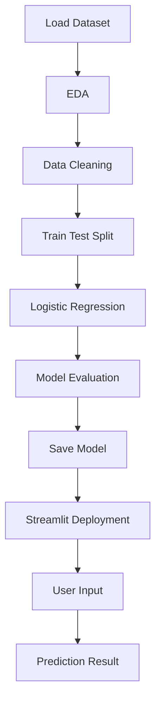

# ❤️ Heart Disease Prediction System using Machine Learning

### Predicting Cardiovascular Risk using Clinical Patient Data

---

## 📌 Overview

The **Heart Disease Prediction System** is an end-to-end Machine Learning application designed to predict the likelihood of heart disease using patient clinical parameters.

Built using **Logistic Regression** and deployed with **Streamlit**, the project demonstrates a complete ML workflow including data exploration, preprocessing, model training, evaluation, serialization, and real-time inference through an interactive web interface.

This project serves as a practical implementation of predictive analytics in healthcare and showcases how machine learning can support early risk assessment.

---

## ✨ Key Highlights

- 📊 **1025 Patient Records Analysed**
- 🧠 **Logistic Regression Classification Model**
- ⚡ **Interactive Streamlit Interface**
- 📦 **Model Serialization using Pickle**
- 🎯 **81.46% Testing Accuracy**
- 🩺 **13 Clinical Features Used for Prediction**
- 🔍 **Real-time Disease Risk Assessment**

---

## 📊 Dataset Summary

| Property | Details |
|---------|---------|
| Total Samples | 1,025 |
| Features | 13 |
| Target Variable | Binary Classification |
| Missing Values | 0 |
| Duplicate Records | 723 |
| Positive Cases | 526 |
| Negative Cases | 499 |

### Target Encoding

| Value | Interpretation |
|-------|---------------|
| **0** | Heart Disease Present |
| **1** | No Heart Disease |

---

## 🩺 Clinical Parameters Considered

| Feature | Description |
|---------|-------------|
| Age | Patient Age |
| Sex | Gender |
| CP | Chest Pain Type |
| Trestbps | Resting Blood Pressure |
| Chol | Cholesterol Level |
| FBS | Fasting Blood Sugar |
| RestECG | ECG Results |
| Thalach | Maximum Heart Rate Achieved |
| Exang | Exercise Induced Angina |
| Oldpeak | ST Depression |
| Slope | ST Segment Slope |
| CA | Major Vessels Count |
| Thal | Thalassemia Status |

---

## 🤖 Model Performance

| Metric | Score |
|--------|-------|
| Training Accuracy | **85.85%** |
| Testing Accuracy | **81.46%** |

The model demonstrates good generalization capability with a relatively small gap between training and testing performance, indicating limited overfitting.

---

## 🌐 Streamlit Application

The web application enables users to enter patient information through an intuitive interface and instantly obtain predictions regarding heart disease risk.

### Prediction Output

✅ **No Heart Disease Detected**

⚠️ **Heart Disease Detected**

---

## 🧠 Machine Learning Workflow

---

### ❤️ Applying Machine Learning for Smarter Healthcare Predictions

⭐ If you found this project interesting, consider giving it a star.

